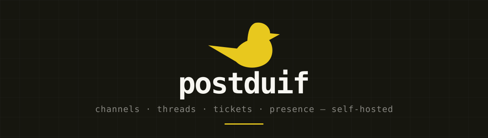

<p align="center">
  
</p>

<p align="center">
  
  
  
  
  
</p>

<p align="center">
  Team messaging for workspaces — channels, threads, direct messages, tickets
  and presence, in a single self-hosted Laravel application.
</p>

<p align="center">
  <a href="#what-it-does">What it does</a> ·
  <a href="#stack">Stack</a> ·
  <a href="#getting-started">Getting started</a> ·
  <a href="#when-it-does-not-work">Troubleshooting</a> ·
  <a href="#architecture">Architecture</a> ·
  <a href="#testing">Testing</a>
</p>

---

Postduif is built around one idea: a workspace decides what it offers. Which
parts of the product are switched on, who may create a channel, who may post in
it, what a guest is allowed to see — all of it is a setting rather than a fork.

## What it does

**Messaging.** Public and private channels, direct messages, group DMs, threaded
replies, quoted replies, reactions, pins, bookmarks, message editing and
deletion, forwarding, and full-text search across everything you may see. Link
previews are fetched in the background; blocked words are censored on the way in.

**Presence and status.** Live presence per channel over WebSockets, a manual
availability status, and status rules that set it for you on a schedule ("away
after 18:00").

**Tickets.** A channel can double as a queue. Tickets carry a status, a
priority, a timeline of events, comments and attachments, and nag their channel
when they go stale.

**Reach outside the app.** Incoming webhooks post into a channel, scheduled
messages go out at a time you pick, invite links and per-person invitations let
people in, and Pushover pushes channel activity to a member's own phone.

**An MCP server.** `/mcp/chat` exposes the chat to AI clients through four
tools — find channels, search messages, send a message, set your status — behind
a personal token, running against exactly the same policies as the web app.

**An admin panel.** Filament v5 at `/admin`, covering workspaces, channels,
messages, attachments, tickets and users.

## Stack

| Layer | Choice |
| --- | --- |
| Backend | PHP 8.3+, Laravel 13 |
| Frontend | Inertia 3 + React 19, TypeScript, Tailwind v4, Radix UI |
| Realtime | Laravel Reverb (WebSockets), Laravel Echo |
| Auth | Laravel Fortify, with passkeys |
| Feature flags | Laravel Pennant |
| Media | spatie/laravel-medialibrary |
| Admin | Filament v5 |
| Database | PostgreSQL |
| Cache / sessions | Redis |
| Containers | Docker, FrankenPHP |
| Tests | Pest 5 |
| Static analysis | Larastan, PHPStan |
| Formatting | Pint (PHP), Prettier + ESLint (TS) |

## Getting started

### With Docker

Requirements: Docker with Compose v2. Nothing else — no PHP, no Node, no
database on your machine.

```bash
git clone git@github.com:SebastiaanKloos/postduif.git postduif && cd postduif
docker compose up
```

That builds the image, starts PostgreSQL, Redis, the app, Reverb, a queue
listener, the scheduler and Vite, installs the dependencies, migrates and seeds.
The first run takes a few minutes; the ones after it take seconds.

Then open <http://localhost:8000> and sign in as `test@example.com` with the
password `password`. Three colleagues (`fenna@`, `joris@`, `amara@`) are seeded
along with a workspace that already has conversations in it, and the login page
offers one-click sign-in for all of them.

The source is bind-mounted, so editing a file changes what the container serves.
Artisan and the rest run inside:

```bash
docker compose exec app php artisan tinker
docker compose exec app php artisan test
docker compose exec app composer lint
```

| Service | Port | What it is |
| --- | --- | --- |
| app | 8000 | The application |
| vite | 5173 | The dev server for the frontend |
| reverb | 8080 | WebSockets |
| postgres | 5432 | Database |
| redis | 6379 | Cache and sessions |

Every one of those is overridable — see [Ports are taken](#ports-are-taken).

`docker compose down` stops it all; add `-v` to throw away the database and
start from a clean seed.

#### Production

A different arrangement of the same image: assets built in, no Vite, no bind
mount, and the worker and scheduler as processes of their own.

```bash
cp .env.example .env    # set APP_KEY, DB_PASSWORD and the REVERB_* values
docker compose -f compose.prod.yaml up -d --build
```

Two things worth knowing before you deploy it:

- **TLS is not in here.** Put a reverse proxy in front and give Reverb a route
  of its own — a browser on an https page will not open a plain `ws://` socket.
- **`REVERB_APP_KEY` and `REVERB_HOST` are baked into the frontend bundle**, so
  they are build arguments rather than runtime settings. Change one and rebuild
  with `--build`; the compose file reads both from your `.env`.
- **Pages are server-rendered by a second image.** Inertia's renderer needs
  Node, and the container that answers requests deliberately has none, so it
  runs as its own `ssr` service: a Node process with the page bundle in it and
  nothing else — no PHP, no source, no credentials, no published port. Stop it
  and the app keeps working; pages are then rendered in the browser instead.

Migrations run in a one-shot `migrate` service that everything else waits for,
so four containers starting at once do not all try to migrate. Uploads live in
the `storage` volume — attachments and transfers are on the private disk, and
without that volume a deployment would take them with it.

### On your own machine

Requirements: PHP 8.3 or newer, Composer, Node 22+, PostgreSQL, Redis.

```bash
git clone git@github.com:SebastiaanKloos/postduif.git postduif && cd postduif
composer setup      # install, .env, key, migrate, npm install, npm run build
```

Point `DB_*` in `.env` at your PostgreSQL database, fill in `REVERB_APP_ID`,
`REVERB_APP_KEY` and `REVERB_APP_SECRET`, then:

```bash
php artisan migrate
composer dev        # serves the app, queue, Reverb and Vite together
```

Alternatively, if you use [Solo](https://soloterm.com), `solo.yml` in the repo
root starts Reverb, the queue listener, Vite and `pail` in one screen — it
assumes the app itself is served by Valet at `https://postduif.test`.

Outside production, `routes/dev.php` adds a quick-login endpoint so you can hop
between seeded users without typing a password.

### When it does not work

#### Ports are taken

The likeliest reason `docker compose up` refuses to start, and the one nobody
can guess: something on your machine is already listening. A local PostgreSQL on
5432 and a Homebrew Redis on 6379 are the usual suspects, and if you also run
this app outside Docker, Reverb is already on 8080.

Find out what is holding a port with `lsof -nP -iTCP:5432 -sTCP:LISTEN`, then
either stop it or move the container's side of it — every published port is a
variable, and compose reads them from your `.env` as well as your shell:

```bash
APP_PORT=8001 REVERB_PORT=8081 FORWARD_DB_PORT=55432 FORWARD_REDIS_PORT=56379 \
  docker compose up
```

`VITE_PORT` moves the dev server. Only the app's own port needs to end up in
`APP_URL` — the rest are told to the browser by the compose file.

#### Reverb does not connect

The websocket is where the chat lives, so this one is visible: messages arrive
only after a reload, and the browser console says the connection to
`ws://localhost:8080/app/...` failed.

- **Is it running?** `docker compose ps reverb` should say healthy, and
  `docker compose logs reverb` should end in `Starting server on 0.0.0.0:8080`.
  If it says *secure* server instead, it is expecting TLS: `REVERB_TLS_CERT`
  names a certificate. The compose file blanks that variable, because a path to
  a certificate on your own machine means nothing inside a container.
- **Is the browser looking in the right place?** The bundle is told
  `VITE_REVERB_HOST=localhost` and the published Reverb port. If you moved that
  port with `REVERB_PORT`, restart the `vite` service so it picks the new one
  up; in production the value is compiled in, so change it and rebuild.
- **Nothing arrives, but the socket is open.** Then it is not Reverb. Check
  `docker compose logs queue` — broadcasts are queued, so a stopped worker looks
  exactly like a broken websocket.

#### The page loads without styling

Vite is not running, or it stopped without cleaning up after itself. Check
`docker compose logs vite`, and if `public/hot` still exists while the container
is down, delete it: it points the app at a dev server that is no longer there.

#### `npm ci` says the lock file is out of sync

Somebody added a dependency without updating `package-lock.json`. That is
deliberate: the container will not silently rewrite a lock file in your working
copy with a different npm than yours. Run `npm install --package-lock-only` on
your own machine and commit the result.

### Environment notes

- `MEDIA_DISK` defaults to `local` **on purpose**. Attachments are served
  through a route that asks whether you may see the channel; a public disk would
  put a screenshot from a private channel one forwarded link away.
- `PUSHOVER_TOKEN` switches phone pushes on for the whole install. Members set
  their own device key in their notification settings.
- Serving over HTTPS means Reverb needs TLS as well — point `REVERB_TLS_CERT`
  and `REVERB_TLS_KEY` at your Valet certificate.

## Architecture

```
app/
├── Actions/        The domain layer, grouped per context
│   ├── Chat/       SendMessage, EditMessage, ToggleReaction, SearchMessages, …
│   ├── Tickets/    CreateTicket, UpdateTicket, RecordTicketEvent, …
│   ├── Users/      SetStatus, ApplyStatusRules, GenerateHandle, StoreAvatar
│   └── Workspace/  Invitations, invite links, guest access, theming
├── Features/       Per-workspace feature flags (Pennant)
├── Policies/       Authorisation — the single source of "may I see this?"
├── Mcp/            MCP server and its four tools
├── Filament/       Admin panel resources
├── Events/         Broadcast events (MessageSent, StatusChanged, …)
└── Http/           Thin controllers, one concern each
```

**Actions carry the logic.** Controllers validate, authorise and delegate.
When behaviour is shared between the web app, the MCP server and a webhook, it
lives in an action, and all three call it — which is why an AI client cannot
sidestep a policy the browser is held to.

**Policies are the one place visibility is decided.** `ChannelPolicy::view`
answers for the channel list, for a single message, for an attachment download
and for MCP search alike.

**Feature flags are classes, not closures.** `app/Features/*` are Pennant
features that also carry a human-readable name and a sentence about what
switching them off costs, so the admin screen can present them honestly. Seven
exist today: scheduled messages, saved messages, forwarding, tickets, webhooks,
invite links and AI access.

**Roles.** `Owner`, `Admin`, `Member` and `Guest`. A guest belongs to the
workspace only as far as the channels they were invited to: they cannot browse
public channels or see who else is in the workspace. Every visibility check asks
`canBrowseWorkspace()` rather than comparing against the case, so a future
restricted role inherits the same treatment.

### Scheduled work

| Command | Interval | Why |
| --- | --- | --- |
| `chat:dispatch-scheduled` | every minute | 09:00 means 09:00 |
| `users:apply-status-rules` | every minute | same reasoning |
| `chat:notify-absent` | every 15 min | shortest threshold on offer is 30 min |
| `tickets:notify-stale` | hourly | thresholds are measured in hours |

## Testing

```bash
php artisan test --compact                    # all tests
php artisan test --compact --filter=Ticket    # one slice
composer test                                 # lint + phpstan + tests
composer ci:check                             # everything CI runs
```

Tests are Pest 5 and run against a real PostgreSQL database (`pcom_testing`,
see `phpunit.xml`). Coverage is feature-first: over a hundred feature test files
exercise the HTTP surface, and unit tests are reserved for logic worth isolating.

Two suites at once — a second person, or an agent working alongside you — will
deadlock on that one database: both truncate the same tables between tests, and
Postgres reports `SQLSTATE[40P01]: Deadlock detected` in whichever run lost.
Give the second one its own:

```bash
createdb pcom_testing_b
PCOM_TEST_DB=pcom_testing_b php artisan test --compact
```

`tests/bootstrap.php` picks that variable up after `phpunit.xml` has had its
say, which is the only point at which it can. The database has to exist —
nothing here creates it.

## Code style

```bash
vendor/bin/pint --dirty     # PHP
npm run lint                # ESLint
npm run format              # Prettier
npm run types:check         # tsc
```

CI runs all four plus PHPStan on every push and pull request.

## Issue tracking

Issues live in [beads](https://github.com/gastownhall/beads) rather than in
GitHub Issues — a local Dolt database under `.beads/`, synced over
`refs/dolt/data` on the git remote. `bd ready` shows what is available to pick
up; `bd prime` explains the rest. `.beads/issues.jsonl` is a passive export, not
the source of truth.

## License

MIT.
